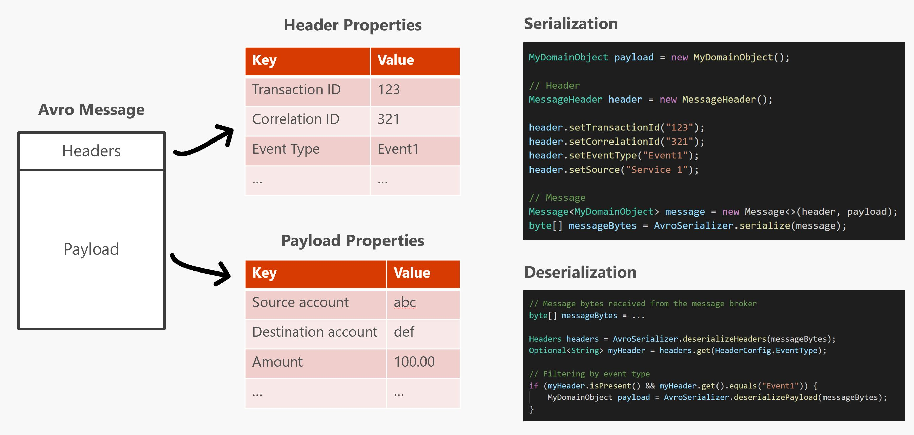

# Avro Serializer for Reactive Microservices

[Apache Avro](https://avro.apache.org/) is a well known data serialization framework designed to provide compact, fast and binary data format. This repo contains an Avro-based framework for reactive microservices scenarios, bringing deserialization performance improvements.

## Communication protocol

Communication protocol between microservices is an important aspect to be considered for a reactive microservices architecture. There are several options out there – like XML, JSON, Protobuf, Avro or Thrift – and the decision of which one to use depends on your criteria about efficiency, ease of use, support in different programming languages, and so on.

There are some benchmarks [[1]](http://labs.criteo.com/2017/05/serialization/) [[2]](https://github.com/eishay/jvm-serializers/wiki) showing that plain JSON or XML are relatively slow in terms of file sizes and serialization/deserialization times. The bulk of XML and JSON, repeating every field name with every single record, is what makes them inefficient for high volume usage. Avro becomes a good choice for a number of reasons:

- It has a direct mapping to and from JSON.
- It has a compact format.
- It has great bindings for a wide variety of programming languages so you can generate Java objects that make working with event data easier, but it does not require code generation so tools can be written generically for any data stream.
- It has a rich, extensible schema language defined in pure JSON.

## Deserialization improvements

When you have a scenario where microservices react to many events with large objects in a topic through a message broker (like [Apache Kafka](https://kafka.apache.org/intro)), data deserialization can be an overhead even using protocols like Avro or Protobuf. Imagine you have a message payload for an event with the following properties:

```
eventType: Event1
transactionId: 123
correlationId: 321
sourceAccount: abc
destinationAccount: def
amount: 100.00
...
```

What if your microservice is consuming both events and need to filter the `eventType` to perform different tasks? You'll have to deserialize the entire payload and, if it's a large object, you can have some performance issues. 

Here is where this framework shines: introduces the concept of **Message** comprised of `Headers` and `Payload`. Headers are key-value pairs for metadata purposes and Payload being whatever object needed. Now we can add the `eventType` as part of the header and other properties in the payload:



Then you can just deserialize the header first instead of deserializing the entire payload to filter by event type.

## Producer

```java
// Payload
MyDomainObject payload = new MyDomainObject();

// Header
MessageHeader header = new MessageHeader();

header.setTransactionId(payload.getTransactionId());
header.setCorrelationId(payload.getCorrelationId());
header.setEventType("Event1");
header.setSource("My microservices name");

// Message
Message<MyDomainObject> message = new Message<>(header, payload);
byte[] messageBytes = AvroSerializer.serialize(message);
```

## Consumer

```java
byte[] messageBytes = ...

Headers headers = AvroSerializer.deserializeHeaders(messageBytes);
Optional<String> myHeader = headers.get(HeaderConfig.EventType);

// Filtering by event type
if (myHeader.isPresent() && myHeader.get().equals("Event1")) {
    MyDomainObject payload = AvroSerializer.deserializePayload(messageBytes);
}
```
